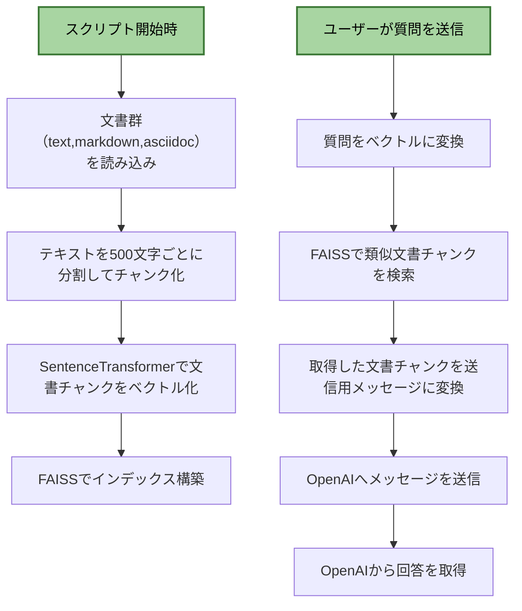

# RagChatBot Sample001

簡易版のRAG ChatBotです。

ブラウザUI（テキスト入力欄、送信ボタン、回答表示）とデバッグ用のログ機能を備え、Markdownおよびテキストファイル（.md, .txt）を入力として処理する仕様です。



実行するには、OpenAIのAPIキーが必要です。OpenAI Platformのアカウントが必要です。（従量課金）

## ファイル

```
ディレクトリ構造
├── documents/ # 入力ドキュメント（AsciiDoc、Markdown、Text）
│ ├── test1.md
│ ├── test2.adoc
│ ├── test3.txt
├── templates/ # HTMLテンプレート
│ ├── index.html # ブラウザUI
├── app.py # FastAPIサーバーコード
├── requirements.txt # 依存ライブラリ
├── .env # 環境変数（OpenAI APIキー）
```
## 準備

私はPython3.11を利用しました。（正確にはWinpython64-3.11.8.0dot.exeを利用しました）

以下で依存ライブラリをインストールします。

```
> python -m pip install -r requirements.txt
```

## 実行

```
> python app.py
```

ブラウザを起動して、`http://127.0.0.1:8000`

## ライセンス

MITライセンスです。  

## 免責事項

本ソフトウェアを使用する際は自己責任でお願いいたします。  
利用により生じた損害等について一切の責任を負いかねます。